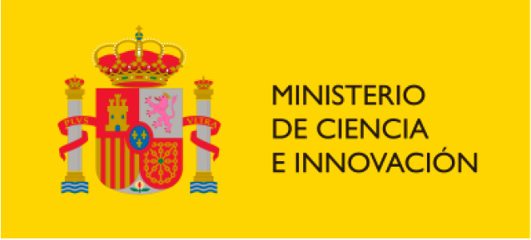

# IoT-Enhanced BP Modeller

This is a contribution of a research work leaded by Pedro Valderas at the PROS Research Center, Universitat Politècnica de València, Spain.

This work presents a web-tool that supports a modelling approach based on BPMN to model IoT-enhanced BPs. This modelling approach is suppoted by a microservice architecture aimed at facilitating the integration of business processes with the physical world that provides high flexibility to support multiples IoT device technologies, and facilitates evolution and maintenance.

This tool is also a key pillar in the creation of digital twins for IoT-Enhanced BPs.

# Acknowledgement

Grant MCIN/AEI/10.13039/501100011033 funded by: 

  
